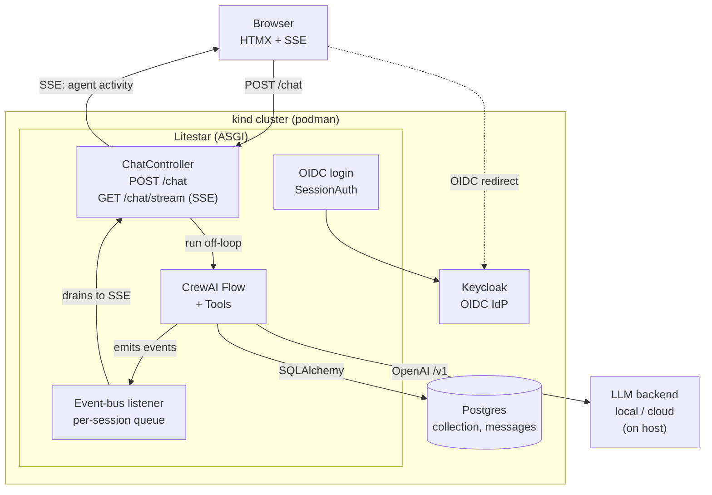

# Agentic Chat Showcase — High-Level Design Spec

**Status:** Draft for alignment
**Date:** 2026-07-06
**Tracking:** `chat-crew-example-q6f`
**Audience:** Whoever writes the follow-on CUJ (Critical User Journey) technical implementation doc, and reviewers who want to attack the architecture before we cut code.

This is the *high-level* design. It fixes the technology choices, the shape of the system, and the load-bearing decisions — grounded in current (mid-2026) documentation for every component. It deliberately stops short of endpoint-by-endpoint contracts, DB column types, and manifest YAML; those belong in the CUJ doc.

---

## 1. Purpose & the demo thesis

We are building a **showcase for agentic chat with visible tool use.** The point being demonstrated is not "an LLM can talk" — it's that an agent, given real tools and a real database, can *do things on the user's behalf* and *show its work* while doing them.

The chosen narrative that makes this concrete: **a video-game collection assistant.** As the user chats naturally ("I've got Elden Ring and Hollow Knight on PC"), the agent:

- **looks games up** in a games database (metadata, release date, platforms),
- **saves them to the user's collection** — chatting *builds up* a persistent collection as a side effect of conversation,
- **prices the collection** (current market value),
- **exports a spreadsheet** of what the user owns and what it's worth.

The user watches the agent decide to call each tool and sees the result folding back in. **We stream the agent's *activity*, not text tokens** — the UI says "looking up Elden Ring…", "saved 2 games to your collection…", "pricing 14 titles…". This is the differentiating UX and the central technical challenge (see §7).

Non-goals: this is not a production SaaS. It's a reference implementation and teaching artifact. We optimize for *legibility and reproducibility* over scale.

---

## 2. Architecture at a glance



Everything except the LLM backend runs as pods in the local kind-on-podman cluster (manifests generated by cdk8s). The LLM backend sits **on the host** deliberately — it wants the host's RAM/GPU, and shouldn't be trapped in the cluster — see §6 and §8.

---

## 3. Technology decisions (and why)

Every choice below was checked against current docs/source in mid-2026. Versions are the ones we target.

| Layer | Choice | Version | Why this and not the obvious alternative |
|---|---|---|---|
| Web framework | **Litestar** | 2.24.x | First-party HTMX plugin *and* first-party SSE (`ServerSentEvent`) — the two things this app leans on hardest are both native, not bolted on. Async-native ASGI. |
| Frontend | **HTMX** + Jinja2 partials | — | Server-rendered fragments + the HTMX SSE extension map 1:1 onto Litestar's named SSE events. No SPA, no build step, no 800MB of node_modules for a chat box. |
| Agent framework | **CrewAI** | 1.14.x (target 1.15 for conversational Flows) | First-class **event bus** emitting typed tool-use events — exactly the hook we need to stream "what the agent is doing." |
| DB | **Postgres** + async SQLAlchemy via **advanced-alchemy** | SQLAlchemy 2.0 / asyncpg | advanced-alchemy is Litestar's first-party data layer: repository/service pattern, DI'd transaction-scoped sessions. |
| Auth | **Keycloak** (OIDC IdP) + **authlib** + Litestar `SessionAuth` | KC 26.6.x | See §5. authlib does the code-flow; Litestar's built-in session auth holds the app session. |
| K8s manifests | **cdk8s** (Python) + `cdk8s-plus-34` | cdk8s 2.70.x | Manifests as Python, not templated YAML. Keeps the whole repo one language. |
| Local cluster | **kind** on **rootful podman** (Linux) | kind 0.32, k8s 1.34 | Answers the open question — see §8. |
| LLM serving | **Ollama** (default) behind OpenAI `/v1` | — | Only server where "pull model + serve with working tool-calls" is genuinely one scripted command, identical on Linux and macOS. See §6. |
| Default model | **Qwen3-Coder 30B** (A3B MoE), Q4_K_M | — | ~96% well-formed tool-call rate, fast MoE (~3B active), ~18GB. Tool-calling is the whole app; we pick for that. |

---

## 4. The agent layer (CrewAI)

**Shape:** a **conversational Flow**, not a `Crew`. A `Crew.kickoff()` runs a fixed task list once to completion — that's task-oriented batch work, wrong for dialogue. CrewAI 1.15 ships conversational Flows: set `conversational = True`, state extends `ConversationState` (`id`, `messages`, `last_user_message`, `session_ready`), and each user message is a new flow run keyed by the same `session_id` with history persisted automatically. Our per-message entrypoint is `handle_turn(msg, session_id=...)`. We do **not** build the chat loop on `kickoff`.

For a single tool-using assistant we don't need multi-agent orchestration; one agent with the tool set, driven by the Flow, is the right altitude. We reserve multi-agent Crews for a possible later "research + summarize" showcase.

**Tools** are `BaseTool` subclasses with a pydantic `args_schema` (validation happens before `_run`; a `ToolValidateInputErrorEvent` fires on bad input, which we can surface). The four showcase tools (§10) each get a schema and a `_run`. Tools receive the authenticated user id via closure/DI so `save_to_collection` writes to the right owner — **tools are constructed per-session, bound to the user**, never global.

**Multi-turn memory:** the Flow's `ConversationState.messages` is the transcript. CrewAI's `memory=True` is *retrieval* memory (vector-backed) — a different thing. We start with just the transcript; retrieval memory is a deferred enhancement, not v1.

### Concurrency — the sharp edges (must be respected)

Two facts from CrewAI source that dictate the backend structure:

1. **`kickoff()` is synchronous and blocking.** `kickoff_async()` is literally `await asyncio.to_thread(self.kickoff, ...)` — a threadpool offload, not native async. Newer `akickoff` is described as natively async; we target `akickoff`/`kickoff_async` and **never** call `asyncio.run()` inside the running loop.
2. **The event bus is a global singleton.** All flows emit onto the same bus. With concurrent chat sessions, streams *mix*. We **route every event by its IDs** (`session`/`task_id`/`agent_id`/`call_id`) into the correct per-session queue, and/or use the `scoped_handlers()` context manager. This is the #1 correctness risk in the whole design.

Corollary: **construct fresh Agent/Flow/tool instances per request (per session).** Agents hold mutable internal state; reuse across concurrent requests bleeds context between users.

---

## 5. Auth — OIDC against Keycloak

**Honest state of the world:** Litestar has no production-grade first-party OIDC plugin. The load-bearing, boring, correct pattern is: **authlib does the authorization-code flow, Litestar's built-in `SessionAuth` holds the resulting app session.**

- `/login` → redirect to Keycloak's authorize endpoint.
- `/auth/callback` → authlib exchanges code for tokens, validates the ID token against Keycloak's JWKS, we upsert the user (`sub`, email) and drop `user_id` into a **server-side** session (`ServerSideSessionConfig`) so we can hold refresh tokens server-side and revoke.
- After that, `request.user` is populated everywhere; unauthenticated hits to non-excluded routes are rejected.

**Keycloak, zero-click:** run `quay.io/keycloak/keycloak:26.6.x` with `start-dev --import-realm`, mounting a committed `demo-realm.json` (via ConfigMap in-cluster) that defines a confidential client (`webapp`, `standardFlowEnabled`, `sslRequired: none`), redirect URIs, and a test user (`alice`/`password`). Import skips existing realms, so it's idempotent. Reproducible-setup workflow: configure once → `kc.sh export` → commit the JSON. (The admin-console "Export" button masks secrets and omits users — we use the CLI export or hand-authored JSON.)

**In-cluster:** a raw `Deployment` + `Service` running `start-dev`, realm mounted from a ConfigMap, reached via ingress or `kubectl port-forward`. **We skip the Keycloak Operator** — it targets production lifecycle (TLS, strict hostname, an external DB it won't provision for you); wrong tool for a laptop. **The one footgun to get right:** the `issuer` claim is baked from the request hostname; if the browser reaches Keycloak at one hostname and the app validates against another, tokens are rejected. `start-dev` is lenient, but we pin `KC_HOSTNAME`/`KC_HOSTNAME_STRICT=false` so the issuer is stable and matches how both the browser and the app reach it. The CUJ doc must nail down the single canonical Keycloak URL used by both sides.

---

## 6. LLM backend strategy

The app talks to **any OpenAI-compatible `/v1/chat/completions` endpoint.** CrewAI's `LLM` makes this a config detail:

```python
LLM(model="openai/<name>", base_url="http://…/v1", api_key="…")   # generic
LLM(model="ollama/<name>")                                        # preset: localhost:11434/v1
```

Three tiers, in order of preference:

### Tier 1 — Local model, one-button (default, recommended)

**Ollama.** It's the only server where *pull-model-and-serve-with-working-tool-calls* is a single scripted command identical on Linux and macOS. The "one button, like `docker compose up`" experience:

- **Detect or bundle** the `ollama` binary (prefer detect/bundle over `curl | sh` — a piped streaming installer leaves a half-installed system on a flaky connection; we do this properly).
- `ollama pull qwen3-coder:30b` (default model), `ollama serve`, point the app at `localhost:11434/v1`.
- A `Makefile` target (`make model-up`) wraps this so it's genuinely one command.

**Model picks** (tool-calling is the selection criterion; Q4_K_M is the quantization floor — below Q4, tool-call reliability degrades before chat quality does; do **not** aggressively quantize the KV cache):
- **Default:** Qwen3-Coder 30B (A3B MoE), ~18GB — fast MoE, top tool-call reliability.
- **24GB machines:** Gemma 4 27B (~16GB) or Qwen3 32B.
- **48GB machines:** Llama 3.3 70B (~42GB) — highest reliability, slower.

**Power-user escape:** document `llama-server --jinja` (raw llama.cpp) for anyone who hits a model whose tool parsing Ollama mis-handles — it gives per-model native parsers and full template control. Not the default; the manual GGUF/flag juggling isn't worth it for most.

### Tier 2 — User-supplied cloud API key

For people who can't run a local model: a settings field for a **user-provided API key** to any OpenAI-compatible cloud, or an Anthropic API key. CrewAI's `LLM` handles both directly — `LLM(model="openai/…", base_url=…, api_key=…)` for OpenAI-compatible clouds, or the native `LLM(model="anthropic/claude-opus-4-8", api_key=…)` provider (no OpenAI-compat shim needed) for Anthropic. Pay-per-token, always permitted, no moving parts. The boring reliable fallback.

### Tier 3 — Claude subscription via the Agent SDK / `claude -p` (the requested "escape hatch")

The original ask was for a "Claude Code" (and GitHub Copilot CLI) escape hatch so people can lean on a subscription they already pay for. **This is legitimate again as of mid-2026 — a correction from an earlier draft of this doc.** The timeline matters because the policy whipsawed:

- **Feb 20 → Apr 4, 2026:** Anthropic prohibited, then blocked, subscription OAuth in third-party harnesses (the "OpenClaw ban").
- **~May 14, 2026:** *reversed.* Anthropic introduced **Agent SDK credits** — a separate monthly pool ($20 Pro / $100 Max 5x / $200 Max 20x, billed at API rates, non-rollover) that explicitly covers "Claude Agent SDK, `claude -p`, and third-party apps built on the Agent SDK," naming OpenClaw directly. Claimable from June 15.
- **Jun 15, 2026:** Anthropic **paused the separate credit plan while revising it**; in the interim, subscription Agent SDK / `claude -p` / third-party usage **draws from the signed-in subscription's normal usage limits**.

So the **sanctioned mechanism** is the **Claude Agent SDK / `claude -p`, authenticated via the user's Claude login** — *not* a reverse-engineered OAuth proxy of the kind Anthropic banned in April. The one caveat we document loudly: the billing story is **actively in flux** (the credit pool is paused as of June 15), so the exact quota/cost behavior may shift again — treat it as "works today, watch for changes."

**Integration wrinkle:** this path is **Anthropic-shaped, not OpenAI `/v1`-shaped**, and it authenticates via the local Claude CLI's login rather than an API key. Two ways to bridge it into our OpenAI-compatible app:

1. **Thin local proxy (recommended for uniformity):** front `claude -p` / the Agent SDK with a small `/v1/chat/completions` shim so the app config is identical to every other backend — just a different `base_url`. Must map tool-calls faithfully (the whole app is tools).
2. **Native Anthropic backend in-app:** `LLM(model="anthropic/…")` in CrewAI — clean, but bypasses subscription auth (it wants an API key), so this collapses into Tier 2 unless we drive the CLI/SDK directly.

**GitHub Copilot** is the weaker leg: the only route is still a reverse-engineered proxy (`copilot-api` and clones) with self-described "may break unexpectedly" status and *undocumented* tool-calling — fatal for an agent app. We document it as unsupported/best-effort and don't build the demo around it.

---

## 7. The streaming contract (the core UX mechanism)

This is the heart of the demo and deserves its own careful design in the CUJ doc. The high-level shape:

**Event source (CrewAI → backend):** a `BaseEventListener` subscribes to the event bus and pushes normalized events into a **per-session `asyncio.Queue`.** The events we care about:

- `ToolUsageStartedEvent` → `{type: "tool_start", tool, args}` — "looking up Elden Ring…"
- `ToolUsageFinishedEvent` → `{type: "tool_end", tool, output, from_cache}` — "saved 2 games"
- `ToolUsageErrorEvent` / `ToolValidateInputErrorEvent` → surface a friendly failure
- (Optional later) `LLMStreamChunkEvent` if we ever want token streaming — deliberately **out of scope for v1** per the thesis: we stream *activity*, not tokens.

**Off-loop execution:** the blocking agent run happens in a worker thread (`anyio.to_thread` / `kickoff_async`); the listener callback pushes onto the queue. The event loop stays free to service every SSE stream and other request.

**Transport (backend → browser):** a Litestar `ServerSentEvent` handler whose async generator **drains the per-session queue** and yields named SSE events (`{"event": "tool_start", "data": …}`), with `ping_interval` to defeat idle-proxy timeouts. If a session is ever watched from multiple tabs, the **Channels plugin** (in-memory/Redis pub-sub) replaces the raw queue.

**Render (browser):** HTMX SSE extension binds `sse-swap="tool_start"` etc. to DOM targets; each event swaps in a rendered activity chip. The final assistant message swaps into the transcript.

**The critical correctness constraint** (restated from §4): the event bus is global and shared across all sessions. Every event must be routed to the *right* session's queue by its embedded IDs, or users see each other's agent activity. The CUJ doc must specify the exact correlation key and the queue lifecycle (creation on turn start, teardown on turn end / disconnect). Keep a live reference to the listener instance — an un-referenced `BaseEventListener` gets GC'd and silently stops firing.

---

## 8. Deployment — "is that kind?"

**Yes, kind — on rootful podman, on Linux.** Reasoning, from current docs:

- kind treats podman as a first-class auto-detected provider (`KIND_EXPERIMENTAL_PROVIDER=podman`); it runs the same node image the k8s project uses for its own conformance testing — closest to "real" upstream Kubernetes.
- **Rootful** podman sidesteps the entire rootless gauntlet (cgroup v2 delegation, the log-driver misdetection bug, PID limits, inotify exhaustion). Reach for rootless only if a security policy forces it, and budget for `containers.conf` tuning.
- **k3d** is the alternative *only* if RAM/startup is the binding constraint (markedly lighter, ~400–600MB) — but it needs a podman Docker-compat socket shim, so it's less clean.
- **Skip minikube's podman driver** — upstream itself flags it experimental and steers you to Docker, and it's outright broken on macOS (`RoutableHostIPFromInside` is Linux-only).
- **`podman kube play` is not Kubernetes** — no API server, no controllers, ignores `replicas`. Irrelevant here; we need a real control plane for cdk8s output.

**macOS note:** everything runs inside the `podman machine` Linux VM regardless of tool. kind-in-podman-machine works; expect port-forward/volume-mount indirection and size the VM up front (`podman machine init --cpus 4 --memory 8192`).

**Manifests:** cdk8s in Python, authored against `cdk8s-plus-34` (pinned to match `kindest/node:v1.34.x` so generated manifests and cluster API agree). Per-environment config is *parameterized Chart constructors*, not a templating DSL — `WebChart(app, "dev", replicas=1)` vs `"prod"`. Charts to define: app (Litestar Deployment + Service), Postgres (Deployment/StatefulSet + Service + PVC), Keycloak (Deployment + Service + realm ConfigMap), ingress. `cdk8s synth` → `kubectl apply -f dist/`.

**In-cluster scope:** app, Postgres, Keycloak run as pods. The **LLM backend stays on the host** (Ollama on the developer's machine, reached via `host.containers.internal` or a headless Service→Endpoints pointing at the host) — the model server wants the host's RAM/GPU and shouldn't be trapped in the cluster. The CUJ doc pins the exact host-reachability mechanism.

---

## 9. Data model (high level)

Postgres, async SQLAlchemy via advanced-alchemy (repository + service pattern, DI'd session). Core entities:

- **User** — mirror of the Keycloak `sub`, plus email/display name. Upserted at OIDC callback.
- **Game** — canonical game metadata (title, platforms, release date, external id from whatever games DB we use). Shared reference data.
- **CollectionEntry** — the join: `(user, game, platform, condition?, acquired_at)`. This is what `save_to_collection` writes and what the spreadsheet export reads. *This table growing as a side effect of chat is the demo's payoff.*
- **Message** — chat transcript rows (`session_id`, role, content, created_at) for history/replay. (CrewAI's Flow state also holds the live transcript; this is the durable copy.)
- **PriceQuote** (optional/cached) — pricing lookups, cached to avoid hammering the pricing source.

The games/pricing data source is an **open question** (§11.1).

---

## 10. The showcase tools

Four tools, each a `BaseTool` with a pydantic schema, constructed per-session bound to the authenticated user:

1. **`videogame_lookup(title)`** — resolve a title to canonical Game metadata. Read-only. Demonstrates the agent gathering info.
2. **`save_to_collection(title, platform)`** — upsert a CollectionEntry for the current user. The write tool. Demonstrates the agent *changing state on the user's behalf*, and is what makes the collection accrete from conversation.
3. **`price_collection()`** (or `price_games(titles)`) — look up current market value for the user's collection. Demonstrates aggregation + external data.
4. **`export_spreadsheet()`** — generate an `.xlsx`/`.csv` of the collection with prices, returned as a download link. Demonstrates producing a real artifact. (Likely `openpyxl`; served via a one-shot download route.)

Each tool's start/finish is what the user sees streamed. Errors (bad title, empty collection) flow back as friendly activity events.

**Swappable data source (per §11.1 decision).** `videogame_lookup` and `price_*` sit behind a small **data-provider interface** with two implementations:

- **`SeededProvider` (v1 default, offline):** reads a bundled games dataset seeded into Postgres and a fixed pricing table. Fully offline, reproducible, no API keys — honors the one-button promise.
- **`LiveProvider` (designed, flag-gated):** hits a live games DB (IGDB/RAWG-style) and a live pricing source. More impressive; needs a key and network.

The agent, tools, and streaming layer are identical across both — only the provider binding changes (`DATA_PROVIDER=seed|live`). This keeps the demo self-contained by default while proving out the "real agent hitting real APIs" story. The CUJ doc pins the live API choice and the provider interface signature.

---

## 11. Open questions / risks (resolve during alignment or in the CUJ doc)

1. **Games + pricing data source. — DECIDED (hybrid).** v1 tools run against a **bundled, seeded static dataset** + a fixed/mock pricing table so the demo is fully offline, reproducible, and honors the "one button" promise. *But the design also specs the live games-DB API path* (IGDB/RAWG-style) behind a config flag, because a live lookup is the more impressive demo — see §10. The tool interfaces are written so the data source is swappable (offline seed ↔ live API) without touching the agent or the streaming layer. Open sub-question for the CUJ doc: exactly which live API (IGDB requires Twitch OAuth; RAWG is a simpler key) and what the pricing source is (PriceCharting-style API vs. mocked).
2. **Escape-hatch tiers (§6). — DECIDED.** Ship Tier 2 (user-supplied API key) *and* Tier 3 (Claude subscription via the Agent SDK / `claude -p`, fronted by a local OpenAI-compat proxy) — the latter is legitimate again post-June-15-2026. Document the in-flux billing caveat and treat GitHub Copilot as unsupported/best-effort. Corrected from an earlier draft that wrongly called the whole subscription path a ToS violation.
3. **Event-bus session routing (§4/§7).** The exact correlation key and queue lifecycle. Highest-risk correctness item; the CUJ doc must specify it precisely and we should spike it early.
4. **Redis or not.** Server-side sessions + SSE fan-out both point at Redis eventually. v1 can use in-memory backends (single replica); decide whether to add Redis to the cluster now or defer.
5. **Postgres in-cluster persistence.** StatefulSet + PVC vs ephemeral Deployment. Ephemeral is simpler and re-seeds cleanly; persistence is more realistic. Lean ephemeral for the demo.
6. **Ingress vs port-forward** for local access, and the single canonical Keycloak hostname (§5 footgun).
7. **macOS parity.** The one-button model flow and kind-on-podman-machine both need explicit Mac testing; the VM indirection is where it'll bite.

---

## 12. Suggested build phases

Rough sequencing for the implementation work (each becomes an epic in `bd`):

1. **Skeleton** — Litestar app, HTMX chat page, echo (no agent), Postgres via advanced-alchemy, `make dev` runs it.
2. **Local model + CrewAI** — one-button Ollama, single agent + `videogame_lookup`, non-streamed round-trip working.
3. **Streaming** — event-bus listener → per-session queue → SSE → HTMX activity chips. The core spike.
4. **The full tool set** — save/price/export; the collection accretes from chat.
5. **Auth** — Keycloak realm import, authlib code-flow, SessionAuth, per-user collections.
6. **Deployment** — cdk8s charts, kind-on-podman, everything running in-cluster.
7. **Polish + escape hatches** — user-supplied API key tier, docs, Mac parity pass.

---

*Next artifact: the CUJ technical implementation doc — endpoint contracts, DB schema, the exact SSE event schema + session-routing design, the cdk8s chart layout, and the one-button model script.*
